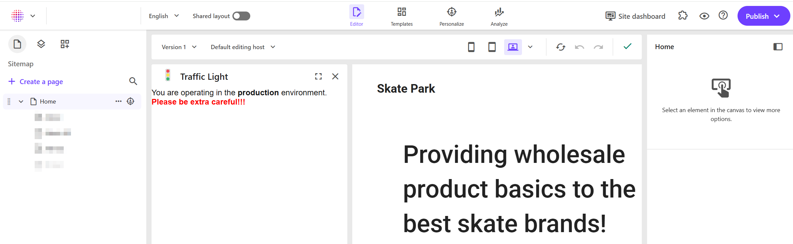
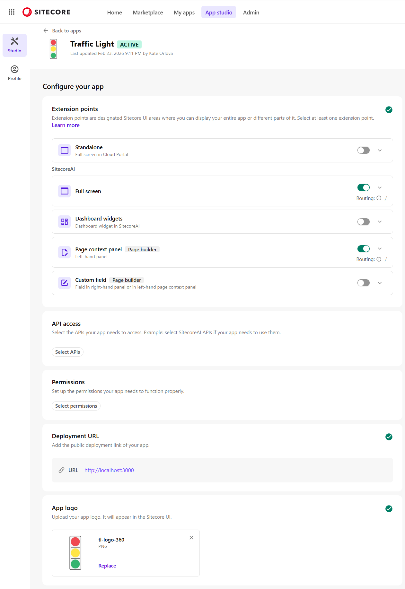

# Traffic Light
There is a single entry point to access the Cloud Portal for all environments and content editors often want a clear visual indication of which environment they are operating in with an extra prompt when editing live content.
The Traffic Light app addresses this need by displaying a visual signal within the Page Builder to show the current environment. It also offers context-specific actions helping editors understand what actions are permitted in each environment.




# Configuration
This is a [Next.js App Router](https://nextjs.org) app created using the [`create-next-app`](https://nextjs.org/docs/app/api-reference/cli/create-next-app) command:
```
npx create-next-app@latest

```
Before proceeding with further configuration, make sure you have the following prerequisites installed:
 - [Node.js](https://nodejs.org/) 16 or later
 - [npm 10](https://docs.npmjs.com/downloading-and-installing-node-js-and-npm) or later

If you wish, you can create a React or Next.js Pages Router app by following the official Sitecore guidelines [here](https://doc.sitecore.com/mp/en/developers/sdk/latest/sitecore-marketplace-sdk/quick-start--manual-.html).

Once your app is created you need to initialise the **Marketplace SDK** and activate it in the **Cloud Portal -> App Studio** following the below steps.

## Step 1: Initialise the Marketplace SDK and start your app
**1.1** Initialise the Marketplace SDK by creating a hook that will manage the SDK’s initialisation & state and handle communication with `window.parent` so the app can run in an `iframe` within the Cloud Portal. See implementation in [/src/utils/hooks/useMarketplaceClient.ts](src/utils/hooks/useMarketplaceClient.tsx)

**1.2** Initialise the Marketplace Client in an Effect Hook and query the API in the app’s main page `src/app/page.tsx`. The script will:
 - check if the Marketplace client is initialised using `useEffect()` hook;
 - query the API and fetch your app content via `client.query("application.context")`;
 - extract the app information from the API response and store it in state via `setAppContext(res.data)`;
 - analyse the environment variable and display the relevant messaging in the user interface, for example: _"You are operating in the production environment. Please be extra careful!!!"_.

See implementation in [src/app/page.tsx](src/app/page.tsx).

**1.3**	Start the app by running `npm run dev` in your terminal and open [http://localhost:3000](http://localhost:3000) in your browser to see the result.

## Step 2: Register, configure and activate the app in the Cloud Portal -> App Studio 
**2.1** Log in to the **[Cloud Portal](https://portal.sitecorecloud.io/)** and navigate to the **App studio**. Click the _Create app_ button to start creating a new app;

**2.2** In the **Create app** modal window select a _Custom_ app type, enter your future app name and click _Create_ button to proceed;

**2.3** After creating the app, configure it by providing the following details:
 - enable **Extension Points**: _Full screen_ and _Page context panel_, i.e. left-hand panel in the Page Builder;
 - set **Deployment URL** to `http://localhost:3000` which is a typical localhost address for Next.js app;


**2.4** Make sure to **activate** and **install** the app before starting any testing!


For more information on configuring a custom app refer to the official Sitecore documentation [here](https://doc.sitecore.com/mp/en/developers/marketplace/configure-and-activate-a-custom-app.html).


# Contribution
Hope you found the Traffic Light app helpful! Your contributions and suggestions are always welcome. Please feel free to submit a pull request.

# License
The SitecoreAI Apps repository is released under the MIT License allowing you to modify and use the code freely including for commercial purposes. Hope this example provides a solid foundation to help you create and customise your own apps to meet your bespoke needs.
If you find this repository useful please consider giving it a star to show your support and share your positive experience!
